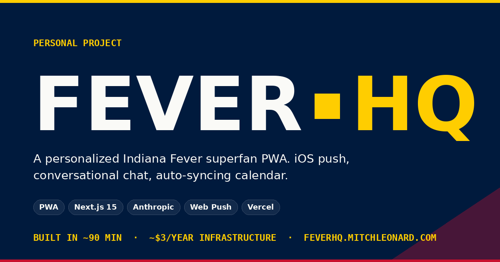

# Fever HQ

A personalized Indiana Fever superfan PWA for one very devoted fan. iOS push notifications, conversational chat, auto-syncing calendar.

[Visit live →](https://feverhq.mitchleonard.com)

Quick read

## Context

My wife is a Caitlin Clark and Indiana Fever superfan. Keeping up with every game means jumping between ESPN, Yahoo Sports, the team site, and her own calendar — and none of those apps are built for one team or one fan. She isn't techy. She just wants the right info to land in front of her at the right time, on the device she already uses.

## Challenge

The first idea was an iMessage bot — texts from "Fever HQ" 15 minutes before every tipoff, branded as a contact she'd save like any other person. Two walls killed it. iMessage limits each Apple ID to a single "Start new conversations from" identity, so bot sends would have read as coming from me, not from Fever HQ. The SMS-provider route around it kept asking for ~$35 in A2P 10DLC registration plus a paid Twilio account before I'd sent a single message — a personal-project budget couldn't justify that for one user.

## Execution

- Pivoted from iMessage / SMS to a custom PWA on mitchleonard.com after the single-identity constraint on iMessage and the $35+ KYC tax on every consumer SMS provider made the original idea unworkable for a hobby project.
- Built a chat-first interface on Next.js 15 + Tailwind v4 with original Fever Navy + Gold + Red branding, custom wordmark, Bebas Neue display type, and a court-line gold accent rule.
- Wired iOS Web Push (iOS 16.4+) for pregame alerts 15 minutes before tipoff. Channel display calls out YouTube TV availability for the major broadcast networks she actually has.
- Streamed Anthropic Claude Haiku 4.5 into the chat surface with a sports-radio system prompt and Central-Time conversion baked in — schedule data sits in Eastern as the broadcaster convention; conversion happens at the edge.
- Wrote a pure-TypeScript ICS generator with stable per-game UIDs so her Google Calendar auto-updates when the WNBA shifts the schedule mid-season. Subscribe once, never touch it again.
- Added a season detector that silently switches the outbound channel from push to email digest from Nov-Apr — off-season runs at zero cost, no code change.
- × Pivot — iMessage MCP. Killed by the single "Start new conversations from" identity constraint on Apple ID.
- × Pivot — Plivo, Twilio, WhatsApp Sandbox, Facebook Messenger. Killed in turn by domain-reputation filtering, $35-40 in 10DLC fees, and Meta's 24-hour messaging window.

- Built in ~90 minutes of active work, idle time excluded.
- Tools: Anthropic Claude Haiku 4.5, Next.js 15, Tailwind v4, Vercel serverless, Web Push API, Phosphor icons, Motion, Cloudflare Email Routing.

## Work

The home and schedule surfaces as they ship to feverhq.mitchleonard.com.

---

Built June 15, 2026 · ~90 min · 8 tools · $3/yr
[GitHub →](https://github.com/mitchleonard/fever-hq) · [Full channel decision memo →](../CHANNEL-DECISION.md)
